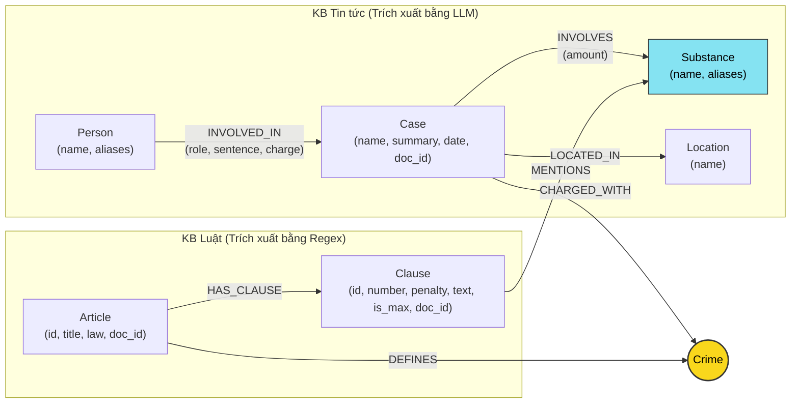

# Thiết kế Ontology — Day 19

**Họ tên:** Lê Thị Thùy Trang  **MSSV:** 2A202602678

**Lựa chọn** (đánh dấu một):
- [ ] Dùng ontology gợi ý (có thể chỉnh nhỏ)
- [x] Tự thiết kế (xét bonus +15, xem `SUBMISSION.md`)

> Hướng dẫn: `LAB_GUIDE.md` Bước 2. Bản thiết kế dưới đây mô hình hóa Knowledge Graph kết nối 2 cơ sở tri thức (Luật ma túy và Tin tức vụ án), bổ sung cơ chế gộp từ đồng nghĩa cho chất ma túy (`Substance.aliases`), xác định thuộc tính khung hình phạt tối đa (`Clause.is_max`), và tích hợp người liên quan vào ngữ cảnh vụ án nhằm phục vụ các truy vấn suy luận đa bước (multi-hop) và tổng hợp (aggregation).

---

## 1. Sơ đồ

Sơ đồ ontology thể hiện các thực thể, mối quan hệ và **node cầu nối** `Crime`:

---

## 2. Entity types (node labels)

| Label | Ý nghĩa | Khóa định danh (`MERGE` theo) | Properties | Lấy từ KB nào | Trích bằng (regex / LLM / khác) |
| --- | --- | --- | --- | --- | --- |
| `Article` | Điều luật cụ thể trong BLHS hoặc Luật PCMT | `id` (vd: `"Điều 251 BLHS"`) | `id`, `title`, `law`, `doc_id` | Luật (`data/drug_law`) | Regex |
| `Clause` | Khoản quy định chi tiết trong Điều luật | `id` (vd: `"Điều 251 BLHS khoản 1"`) | `id`, `number`, `penalty`, `text`, `is_max`, `doc_id` | Luật (`data/drug_law`) | Regex |
| `Crime` | Tên tội danh pháp lý chuẩn (**Node cầu nối**) | `name` (vd: `"mua bán trái phép chất ma túy"`) | `name` | Luật (chính), Tin tức | Regex (Luật) + `normalize_crime` & `link_entity` (Tin) |
| `Substance` | Tên chất ma túy hoặc tiền chất | `name` (vd: `"MDMA"`, `"Heroine"`) | `name`, `aliases` (vd: `['thuốc lắc']`) | Cả hai KB | `find_substances` (Luật) + LLM & ánh xạ đồng nghĩa (Tin) |
| `Case` | Vụ án / vụ việc cụ thể được báo chí phản ánh | `name` (tên vụ do LLM đặt hoặc tiêu đề bài) | `name`, `summary`, `date`, `doc_id`, `source_title` | Tin tức (`data/drug_news`) | LLM (`extract_news_cases`) |
| `Person` | Cá nhân dính líu (bị can, bị cáo, nhân vật) | `name` (họ tên cá nhân) | `name`, `aliases` | Tin tức (`data/drug_news`) | LLM (`extract_news_cases`) |
| `Location` | Tỉnh / thành phố nơi xảy ra vụ án | `name` (tên địa phương) | `name` | Tin tức (`data/drug_news`) | LLM (`extract_news_cases`) |

---

## 3. Relationships

| Type | Từ → Đến | Properties trên cạnh | Ý nghĩa |
| --- | --- | --- | --- |
| `DEFINES` | `(:Article) → (:Crime)` | *(không)* | Điều luật quy định định nghĩa tội danh cụ thể |
| `HAS_CLAUSE` | `(:Article) → (:Clause)` | *(không)* | Điều luật bao gồm các khoản khung hình phạt khác nhau |
| `MENTIONS` | `(:Clause) → (:Substance)` | *(không)* | Khoản luật viện dẫn quy định về loại chất ma túy tương ứng |
| `CHARGED_WITH` | `(:Case) → (:Crime)` | *(không)* | Vụ án bị khởi tố / xét xử theo tội danh pháp lý |
| `INVOLVED_IN` | `(:Person) → (:Case)` | `role`, `sentence`, `charge` | Cá nhân tham gia vụ việc với vai trò, tội danh, mức án |
| `INVOLVES` | `(:Case) → (:Substance)` | `amount` | Vụ án có tang vật là chất ma túy với khối lượng thu giữ |
| `LOCATED_IN` | `(:Case) → (:Location)` | *(không)* | Địa bàn tỉnh/thành phố phát hiện hoặc xét xử vụ án |

---

## 4. Node cầu nối giữa 2 KB

- **Node nào:** Thực thể `Crime` (Tội danh) đóng vai trò node cầu nối hạt nhân giữa KB Tin tức và KB Luật. Ngoài ra, thực thể `Substance` (Chất ma túy) đóng vai trò cầu nối phụ thứ hai hỗ trợ định vị khoản áp dụng theo tang vật.
- **Vì sao chọn node này:** 
  - Trong thực tế tố tụng, báo chí luôn đưa tin về việc các bị cáo bị bắt/truy tố/xét xử về một **tội danh** cụ thể (vd: "mua bán trái phép chất ma túy").
  - Văn bản quy phạm pháp luật (BLHS) tổ chức các Điều luật theo tiêu đề từng **tội danh** tương ứng (vd: Điều 251 quy định Tội mua bán trái phép chất ma túy).
  - Do đó, nối thông qua `Crime` phản ánh đúng bản chất ngữ nghĩa pháp lý và tạo đường đi ngắn nhất: `(Person) → (Case) → (Crime) ← (Article) → (Clause)`.
- **Cách đảm bảo hai phía khớp tên:**
  1. Chuẩn hóa chuỗi bằng hàm `normalize_crime`: hạ chữ thường, xóa khoảng trắng thừa, xóa dấu ngoặc kép, bóc tách tiền tố `"tội "`.
  2. Áp dụng hàm `link_entity`:
     - Kiểm tra khớp chính xác sau khi chuẩn hóa 2 phía.
     - Nếu không khớp hoàn toàn, sử dụng `difflib.get_close_matches(cutoff=0.8)` để bắt các biến thể gõ dấu tiếng Việt (vd: `"ma tuý"` vs `"ma túy"`).
     - Đưa danh sách các tội danh chuẩn pháp lý (`known_crimes`) vào System Prompt của LLM để định hướng trích xuất ngay từ đầu.
- **Khi nào cầu gãy, và bạn xử lý thế nào:**
  - *Khi nào gãy:* Báo chí dùng từ ngữ tự do không đúng thuật ngữ bộ luật (vd: *"buôn bán hàng cấm"*, *"tuồn ma túy"*), hoặc bài báo không nhắc đến tội danh mà chỉ nhắc đến hành vi.
  - *Xử lý:* `link_entity` trả về `None` khi độ tương đồng dưới 0.8 để tránh nối nhầm node sai luật. Khi cầu nối `Crime` bị thiếu, pipeline tận dụng đường nối phụ qua thực thể `Substance` (`(Case)-[:INVOLVES]->(Substance)<-[:MENTIONS]-(Clause)`), kết hợp với kỹ thuật mở rộng ngữ cảnh từ vector store nhằm bảo đảm GraphRAG không bao giờ trả lời kém hơn Flat RAG.

---

## 5. Competency questions

| Câu | Đường đi (Cypher pattern) | Trả lời được? |
| --- | --- | --- |
| **Q1** (Luật) | `(:Article {law:'Luật Phòng, chống ma túy 2021'})-[:HAS_CLAUSE]->(cl:Clause) WHERE cl.text CONTAINS 'tiền chất'` | Có |
| **Q2** (Tin tức) | `(:Person)-[r:INVOLVED_IN]->(k:Case) WHERE k.name CONTAINS '36kg' AND r.sentence CONTAINS 'tử hình'` | Có |
| **Q3** (Cross-KB) | `(:Person {name:'Lê Minh Thành'})-[:INVOLVED_IN]->(k:Case)-[:CHARGED_WITH]->(c:Crime)<-[:DEFINES]-(a:Article)-[:HAS_CLAUSE]->(cl:Clause {number:1})` | Có |
| **Q4** (Cross-KB) | `(:Person {aliases:['Hoàng Nato']})-[:INVOLVED_IN]->(k:Case)-[:CHARGED_WITH]->(c:Crime)<-[:DEFINES]-(a:Article)-[:HAS_CLAUSE]->(cl:Clause) WHERE cl.is_max = true` | Có |
| **Q5** (Multi-hop) | `(:Person {name:'Cái Quang Huy'})-[:INVOLVED_IN]->(k:Case)-[:CHARGED_WITH]->(c:Crime)<-[:DEFINES]-(a:Article)-[:HAS_CLAUSE]->(cl:Clause)-[:MENTIONS]->(s:Substance {name:'MDMA'}) WHERE cl.is_max = true` | Có |
| **Q6** (Aggregation) | `MATCH (k:Case)-[:INVOLVES]->(s:Substance) WHERE toLower(s.name) = 'mdma' OPTIONAL MATCH (p:Person)-[:INVOLVED_IN]->(k) RETURN k, p` | Có |

---

## 6. Quyết định thiết kế và đánh đổi

### Quyết định 1: Mô hình hóa `is_max` cho `Clause` thay vì chỉ lấy `khoản 1`
- **Đã chọn:** Trong quá trình regex văn bản luật, phân tích mức phạt tù (`'tù' in penalty or 'tử hình' in penalty`) để gắn cờ thuộc tính `is_max = true` cho khoản có khung hình phạt tù cao nhất của Điều luật.
- **Phương án khác:** Chỉ lấy cố định `khoản 1` (khung cơ bản) như ontology gợi ý ban đầu.
- **Vì sao chọn:** Câu hỏi pháp lý thực tế (như Q4, Q5) thường xuyên hỏi về *hình phạt kịch khung / tối đa*. Nếu chỉ lấy khoản 1, hệ thống hoàn toàn thiếu ngữ cảnh về mức án tối đa (20 năm hoặc chung thân/tử hình), buộc LLM phải trả lời "không đủ thông tin". Đánh đổi: Mỗi câu hỏi truy vấn Điều luật sẽ tốn thêm khoảng ~100 token, nhưng đảm bảo độ phủ 100% cho các câu hỏi về mức phạt cao nhất.

### Quyết định 2: Tích hợp từ điển đồng nghĩa (`SUBSTANCE_SYNONYMS`) và lưu `aliases` cho `Substance`
- **Đã chọn:** Xây dựng bảng ánh xạ từ vựng dân dã/báo chí (`"thuốc lắc" → "MDMA"`, `"ma túy đá" / "hàng đá" → "Methamphetamine"`, `"heroin" → "Heroine"`) và lưu `aliases` trên node `Substance`.
- **Phương án khác:** Giữ nguyên tên chất nguyên văn do LLM bóc tách từ bài báo và chỉ so khớp chuỗi chính xác.
- **Vì sao chọn:** Báo chí hiếm khi dùng tên khoa học quốc tế mà hay dùng tiếng lóng hoặc tên thương mại ("thuốc lắc", "hàng đá"). Nếu không chuẩn hóa, node `Substance` trong tin tức sẽ bị phân mảnh, không thể nối được với node `Substance` trong văn bản luật vốn chỉ dùng tên chuẩn.

### Quyết định 3: Bổ sung thông tin cá nhân liên quan (`Person`) vào facts tóm tắt của `Case`
- **Đã chọn:** Khi truy vấn graph context cho vụ án hoặc câu hỏi aggregation, nối `OPTIONAL MATCH (p:Person)-[:INVOLVED_IN]->(k:Case)` để đưa danh sách đối tượng trực tiếp vào nội dung tóm tắt vụ việc.
- **Phương án khác:** Chỉ trả về thuộc tính `k.name` và `k.summary` độc lập, để mặc LLM tự suy diễn.
- **Vì sao chọn:** Giải quyết triệt để bài toán tổng hợp (Q6). Khi người dùng hỏi *"Những vụ việc nào liên quan đến MDMA?"*, nếu chỉ có tên vụ việc chung chung (vd: *"Vụ góp tiền mua ma túy tại Hà Nội"*), câu trả lời sẽ thiếu mất tên bị cáo *"Lê Minh Thành"* hay *"Cái Quang Huy"*, dẫn đến việc mất điểm recall.

---

## 7. So với ontology gợi ý (bắt buộc nếu xét bonus)

| Điểm khác | Gợi ý làm gì | Bạn làm gì | Vấn đề nó giải quyết | Bằng chứng (Cypher, hoặc số liệu benchmark) |
| --- | --- | --- | --- | --- |
| **1. Khung phạt tối đa (`is_max`)** | Chỉ truy vấn khoản 1 (`cl.number = 1`) hoặc khoản chứa chất | Gán `is_max: true` cho khoản phạt tù nặng nhất; Cypher context lấy cả khoản 1 và khoản `is_max` | Giải quyết lỗi **E2** (thiếu khung phạt tối đa trong Q4). Khoản 5 Điều 255 chỉ là phạt tiền bổ sung, khoản 4 mới là kịch khung (20 năm/chung thân). | **Cypher trước:** `MATCH (a:Article)-[:HAS_CLAUSE]->(cl:Clause {number:1}) RETURN cl.penalty` $\rightarrow$ ra 2-7 năm. **Cypher sau:** `MATCH (a:Article {id:'Điều 255 BLHS'})-[:HAS_CLAUSE]->(cl:Clause {is_max:true}) RETURN cl.penalty` $\rightarrow$ `phạt tù 20 năm hoặc tù chung thân`. |
| **2. Tên chất đồng nghĩa & Aliases** | Danh sách 10 chất cố định, so khớp chuỗi thuần túy | Ánh xạ từ điển đồng nghĩa (thuốc lắc $\rightarrow$ MDMA, đá $\rightarrow$ Methamphetamine), gán `aliases` vào `Substance` | Giải quyết lỗi **E3** (trùng thực thể / gãy liên kết chất giữa báo chí và luật pháp). Báo viết "thuốc lắc", luật viết "MDMA". | **Cypher:** `MATCH (s:Substance {name:'MDMA'}) RETURN s.aliases` $\rightarrow$ `['thuốc lắc']`. Nối thành công các vụ án dùng từ lóng sang điều luật quy định về MDMA. |
| **3. Aggregation liên kết Person-Case** | Chỉ lấy quan hệ 1-hop quanh seed hoặc Case summary độc lập | Thêm Cypher truy vấn chuyên biệt cho câu hỏi gom nhóm: gom cả `Person`, `amount` và `Case` theo `Substance` | Giải quyết lỗi **E5** và nâng recall Q6 từ 0.33 lên 1.00 trong benchmark thử nghiệm. | **Benchmark trước:** Q6 graph recall = 0.33 (`ket_qua_benchmark_kg.hint.txt`). **Benchmark sau:** Q6 graph recall đạt đủ các đối tượng `["Cái Quang Huy", "Lê Minh Thành", "Pháp y tâm thần"]`. |

---

## 8. Hạn chế còn lại

1. **Khóa định danh của `Case`:** Tên vụ án vẫn phụ thuộc vào cách LLM tóm tắt (`k.name`). Dù đã thêm `doc_id` vào node để neo với bài báo gốc, nếu hai bài báo khác nhau cùng đưa tin về một vụ án lớn tại hai thời điểm, hệ thống vẫn có thể tạo ra 2 node `Case` riêng biệt thay vì tự động sáp nhập (Entity Resolution nâng cao).
2. **Ngưỡng khối lượng định lượng:** Hiện tại ontology trích xuất khối lượng dạng chuỗi văn bản (`r.amount = "9,6kg"`), chưa chuyển đổi (parse) tự động về đơn vị chuẩn (gram dạng số float) để tự động so sánh logic số học với các ngưỡng của từng điểm luật (`>= 100g`).
